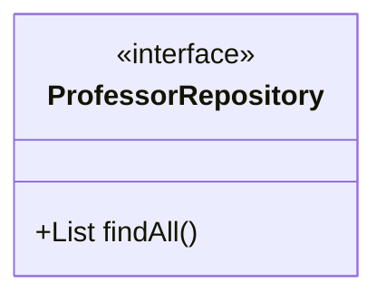
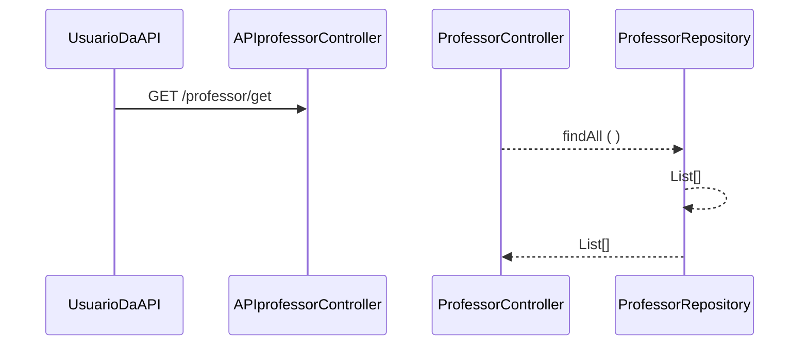

### Fatec - Centro Paula Souza
##### Curso - Desenvolvimento de Software Multiplataforma
##### Estudo de Caso – _Auto Notas_

> No contexto do projeto interdisciplinar o estudo de caso tem como objetivo desenvolver e implantar o Sistema _nome do projeto_. O projeto tem como objetivo facilitar a análise das vendas para apoio a tomada de decisão. É possível analisar
o histórico das vendas por mês e ano. O relatório do produto mais vendido.....
Time de desenvolvimento
- Felipe Soares Batista da Cruz
- Lucas Chaves do Nascimento
- Lucas de Oliveira Santos
- Luis Felipe Rodrigues Lima 

##### Instalação
O projeto esta em desenvolvimento utilizando STS4 e a linguagem Java 17.
- No Github selecione a opção clone e copie o endereço do repositório.
- No STS4 abra a perspectiva Git opção clone.
- Ao terminar o download import o projeto para o workspace
- A classe CursoApplication inicializa a execução do projeto

##### Processo de Desenvolvimento de Software - PDS
> O PDS segue uma abordagem interativa incremental adaptada do Scrum. A definição de pronto estabelece os mecanismos para controle de qualidade da aplicação.

##### Análise de risco
> O resultado da análise conclui que será possível implementar o projeto no semestre com grupos de alunos atuando como programadores. O maior risco identificado é a falta de tempo para reunião do time de desenvolvimento e estudo
do projeto. O grupo deve definir estratégias para mitigar o risco de dificuldades com a linguagem de programação, identificando membros do grupo com problemas na programação, selecionando videoaulas, referência bibliográficas, para
melhora a produtividade do time.

##### Product Backlog
> Cada estória tem um identificador único de maneira que seja possível rastrear a necessidade do cliente com a implementação do software.

<b>| Quem? | O que? | Para que?|</b>

1 - Como professor, eu quero cadastrar meus alunos, para que eles possam acompanhar as notas.

2 - Como professor, eu quero atribuir notas de forma organizada, para que os alunos acompanhem as notas.

3 - Como aluno, eu quero ter acesso à plataforma, para que eu acompanhe minhas notas.

4 - Como aluno, eu não quero que outros alunos tenham acesso às minhas notas, para que mantenha minha privacidade.

5 - Como aluno, eu quero ter a plataforma online sempre, para que eu possa acompanhar minhas notas em qualquer horário.

6 - Como professor, eu quero dar feedbacks das atividades, para que meus alunos se mantenham atualizados.

7 - Como professor, eu quero criar salas de forma organizada, para que a localização na plataforma seja facilitada.

8 - Como professor, eu quero poder editar as notas e feedbacks, para que se mantenham atualizados

##### Definição de pronto
> O sprint será considerado concluido quando:
> 1) Os casos de teste de aceitação forem executados e obtiverem 100% de satisfatorios. Os casos de teste (CT) são rastreáveis para os requisiitos (REQ). O elo de rastreabilidade é estabelecido pelo identificador do caso de teste.
> 2) Depois de executado os casos de teste com 100% de satisfatorios o código deve ser armazenado no github (commit).
> 3) O relatório do SonarLint foi gerado e revisado.

##### Casos de teste
<b>| Cenário de uso |</b>

CT01 - Cadastrar alunos com sucesso
Dado que a sala está criada
Quando possuímos a informação do aluno
Então o aluno é adicionado no Sistema.

CT02 - Atribuir notas
Dado que os alunos já estão cadastrados
Quando possuímos as notas das atividades
Então é atribuida as notas para o aluno em especifíco.

CT03 - Acessar plataforma
Dado que o aluno já está cadastrado
Quando ele acessar a plataforma
Então será possível visualizar suas Notas

CT04 - Privacidade dos dados
Dado que o aluno já está cadastrado
Quando ele consultar suas notas
Então ele apenas terá acesso as suas próprias informações

CT05 - Disponibilidade da plataforma
Dado que o usuario precisa utilizar a plataforma
Quando acessá-lá
Então ela deve estar disponível.

CT06 - Feedback de atividades
Dado que as atividades foram realizadas
Quando o professor for atribuir os feedbacks 
Então deve ser possível conceder o feedback

CT07 - Criar Salas
Dado que o professor precise criar a sala
Quando ele for cria-la
Então deve ser possível criar a sala

CT08 - Editar Notas
Dado que o professor errou na atribuição de notas
Quando for necessário corrigi-las
Então deve ser possivel editar a nota

>

O modelo de dominio (Larman, 2006 - classes conceituais ou classes de negócio) foi definido considerando as seguintes classes:

A arquitetura segue uma abordagem orientada a serviços. Os serviços foram classificados em três tipos (ERL, 2007):

- **1. Serviços utilitários**. Implementam funcionalidades comuns a vários tipos de aplicações, como, por exemplo: log, notificação, transformação de informações. Um exemplo de serviço utilitário é um serviço de conversão de moeda que
poderá ser acessado para calcular a conversão de uma moeda (por exemplo, dólares) para outra (por exemplo, euros).

- **2. Serviços de entidade (serviços de negócios)**. Derivado de uma ou mais entidades de negócio (domínio), possuindo um alto grau de reutilização. Geralmente são serviços que fazem operações CRUD (Create, Read, Update e Delete).

- **3. Serviços de tarefa (coordenação de processos-workflow)**. Tipo de serviço mais específico que possui baixo grau de reuso. Consome outros serviços para atender seus consumidores. São serviços que suportam um processo de negócios
amplo que geralmente envolve atividades e atores diferentes. Um exemplo de serviço de coordenação em uma empresa é um serviço de pedidos em que os pedidos são feitos, os produtos são aceitos e os pagamentos são efetuados.
A visão lógica da arquitetura para API de Professor é apresentada na figura abaixo. A visão lógica descreve como o código está organizado, as classes os pacotes e os relacionamentos entre eles.

>A entidade Professor foi identificada como um serviço (ERL, 2007 - serviço do tipo entidade). A visão lógica da arquitetura (Krutchen, 1995)
>descreve a organização do código. O contrato das operações de sistema (LARMAN, 2006, pag.140) foi definido no diagrama abaixo.

> Operação consulta todos - o diagrama de sequência abaixo descreve como os varios componentes do projeto devem colaborar para atender
> o comportamento da função consulta todos.

>Referencias
- [1] KRUCHTEN, Philippe. Reference: Title: Architectural blueprints—the “4+ 1” view model of software architecture. IEEE software, v. 12, n. 6, 1995.
- [2] ERL, Thomas. SOA principles of service design (the Prentice Hall service-oriented computing series from Thomas Erl). Prentice Hall PTR, 2007.
- [3] LARMAN, Craig. Utilizando UML e padrões. 2aed., Porto Alegre: Bookman Editora, 2006 (pag. 147).
